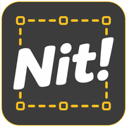

<p align="center"></p>

# nit

> Point-and-click website annotation that hands small UI fixes straight to a coding agent.

[](https://github.com/spaceparrots/nit/actions/workflows/ci.yml)
[](https://www.npmjs.com/package/@spaceparrots/nit)
[](./LICENSE)

You are browsing your product and spot the little things: a badge in the wrong color, an unfilled
star icon, a dead active-state. Filing tickets for those is overkill, and describing them to an AI
agent in prose loses too much ("the third tile... no, on the landing page...").

**nit** is the missing input device. Click the element, type the nit, done. Every annotation
records a stable reference to the element (component tag, unique CSS selector, XPath, screenshot)
plus the route and viewport. That is precise enough for a coding agent to find the source and fix
it without any further context.

The name comes from code-review culture, where reviewers prefix minor comments with `nit:`.

## The loop

```
┌────────────┐      ┌───────────────────┐      ┌────────────┐
│ nit review │ ───► │ your coding agent │ ───► │ nit verify │ ─── reopened? ──┐
│  annotate  │      │  fixes each open  │      │  before /  │                 │
│  the site  │      │  change-request   │      │   after    │ ◄───────────────┘
└────────────┘      └───────────────────┘      └────────────┘
```

1. `nit review https://staging.example.com` opens a real Chromium with an annotation overlay and
   a devtools-style panel window beside it. Alt-click elements, describe the changes, save.
2. Hand the produced `nit-review/` folder to a coding agent, or serve it as an
   [MCP server](./docs/wiki/mcp.md) with `nit mcp`. The agent fixes each open change request and
   marks it `fixed`.
3. `nit verify nit-review/annotations.json` reopens the site, captures **after** screenshots next
   to the originals, and lets you rule each fix **Verified** or **Reopen**.

Teammates review on their own and share zips (`nit export` / `import` / `merge`). The
[workflow guide](./docs/workflow.md) walks through all of it.

## Install

```bash
npm install -g @spaceparrots/nit
nit doctor        # checks Node ≥ 20.12 and dependencies, offers to install Chromium (one time)
nit setup         # per project: review dir, .gitignore, MCP server (interactive wizard)
```

Or without installing: `npx @spaceparrots/nit review https://example.com`

## Commands

| Command | Alias | What it does |
| --- | --- | --- |
| `nit setup` | `init` | One-time project setup: review dir, .gitignore, MCP (wizard) |
| `nit review <url>` | `r`, `annotate` | Open a browser and annotate a site |
| `nit view <file>` | `v`, `replay` | Replay a feedback file with pins re-anchored on their routes |
| `nit verify <file>` | `check` | Capture after-shots for fixed items, rule Verified / Reopen |
| `nit status [dir]` | `stats` | What is in a review: file, last change, counts, what is left |
| `nit export [dir]` | `pack` | Pack a review into a shareable zip |
| `nit import <zip>` | `unpack` | Unpack a teammate's review zip |
| `nit merge <file...>` | `combine` | Combine feedback files into one consolidated review |
| `nit mcp [dir]` | `serve` | Serve a review folder as an MCP server (stdio) |
| `nit mcp-install [dir]` | `mcp-config` | Register the MCP server in this project's .mcp.json |
| `nit doctor` | | Check the environment, install Chromium if missing |

All flags are in the [command reference](./docs/wiki/commands.md); reviewing itself (picking,
the panel, viewports) is covered in [reviewing in the browser](./docs/wiki/reviewing.md).

## What you get

```
nit-review/
├─ annotations.json     # structured, agent-readable
├─ review.md            # human-readable, screenshots embedded, ACTIONABLE markers
├─ fix-annotations.md   # the contract for the fixing agent
└─ shots/*.png          # context screenshots (+ after-shots from nit verify)
```

Each annotation carries the element reference (component, selector, XPath, text), the route and
viewport, a status (`open`, `fixed`, `verified`, `reopened`, `wontfix`), optional issue ref, and
a click trail for reproducing hidden states. Field-by-field details are in the
[annotation file reference](./docs/wiki/annotations.md).

## Agent handoff

Point your agent at the folder and let it follow `fix-annotations.md`, or register the MCP
server (`nit mcp-install`) and let it work through tools: `nit_list_annotations` (rows carry the
full working record), `nit_get_annotation` (batchable; screenshots included as images),
`nit_mark_fixed`, `nit_set_status` (with a persisted `reason` for wontfix), `nit_set_issue_ref`.
Payloads are deliberately token-lean. The review is also readable as resources
(`nit://review/brief.md`, `nit://review/annotations.json`, `nit://annotation/<id>`, …) for
sessions without tool access. [MCP server and coding agents](./docs/wiki/mcp.md) has the details
and prompt suggestions.

## Documentation

- [Getting started](./docs/wiki/getting-started.md): install, first review, first fix
- [Workflow guide](./docs/workflow.md): the full loop, solo and with a team
- [Reviewing in the browser](./docs/wiki/reviewing.md): picking, the panel, viewports
- [MCP server and coding agents](./docs/wiki/mcp.md): tools, setup, agent prompts
- [Command reference](./docs/wiki/commands.md): every command and flag
- [Annotation file reference](./docs/wiki/annotations.md): the schema agents read
- [How nit works](./docs/wiki/how-it-works.md): architecture and trust model
- [CONTRIBUTING.md](./CONTRIBUTING.md) and [src/README.md](./src/README.md): for contributors

## License

nit is licensed under the [GNU AGPL-3.0](./LICENSE). It is free to use, modify and self-host. The
copyleft terms mean that any distributed or **network-hosted** modified version must make its
source available under the same license, so nobody can take nit closed-source and resell it.

Need to use nit in a way AGPL-3.0 does not allow, for example embedding it in a closed-source or
commercial product? A separate commercial license is available. Reach out to
[kevin.mattutat@spaceparrots.de](mailto:kevin.mattutat@spaceparrots.de).
